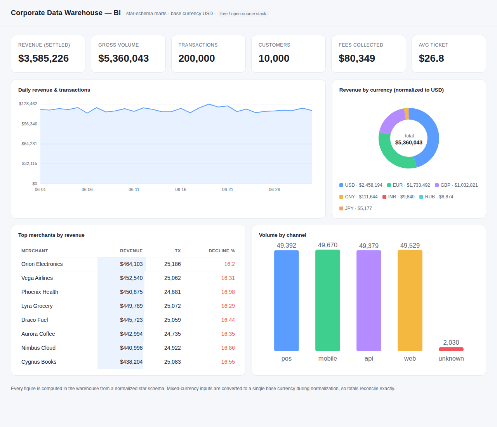

# Free Data Warehouse + Embedded BI

A modern, **100% free / open-source** corporate data warehouse (КХД) with a
built-in BI dashboard, built-in data normalization, and a data-quality gate that
makes "no errors" a *checked* property rather than a hope.

It ships as one small, readable codebase that:

- **runs end-to-end locally right now** on [DuckDB](https://duckdb.org) (embedded,
  columnar, free), and
- **scales to 1 000 000 000 transactions/day and 2000 TB** on
  [ClickHouse](https://clickhouse.com) + object storage — the *same layered SQL
  model*, just a different physical engine.

```
generate ─▶ ingest (raw) ─▶ normalize (staging ▶ dims/fact) ─▶ marts ─▶ BI dashboard
                                    │
                              data-quality gate  ◀── fails loud on bad data
```



---

## Quick start (no infrastructure needed)

```bash
cd dwh_bi
pip install -r requirements.txt          # duckdb + pyarrow, that's it

python cli.py build  --rows 200000       # generate → normalize → build marts
python cli.py serve  --port 8080         # open http://127.0.0.1:8080  (embedded BI)
python -m pytest tests -q                # prove it: full test suite, green
```

Other commands:

```bash
python cli.py query  --metric revenue --by channel     # governed ad-hoc metrics
python cli.py bench  --rows 500000                      # throughput + 1B/day extrapolation
python cli.py sizing --tx-per-day 1000000000 --capacity-tb 2000   # capacity planner
```

---

## What's inside

| Layer | Tables | Purpose |
|-------|--------|---------|
| **raw** | `raw.transactions` | Landing zone. Append-only, untyped, full lineage (`_source`, `_batch_id`, `_ingested_at`). Nothing is discarded. |
| **staging** | `staging.transactions` | Typed, trimmed, defaulted, **deduplicated**. Still one row per event. |
| **core** (normalized 3NF + star) | `dim_date`, `dim_currency`, `dim_merchant`, `dim_account`, `dim_customer` (**SCD-2**), `fact_transaction` | Conformed dimensions + a clean fact. All money also carried in a single **base currency**. |
| **mart** (BI-facing) | `mart_daily_revenue`, `mart_merchant_performance`, `mart_currency_mix`, `mart_channel_status`, `mart_customer_360` | Pre-aggregated, query-ready. |

### Built-in normalization (`warehouse/normalize.py`)

1. **Type coercion & cleaning** — `try_cast` timestamps/decimals, trim, upper/lower, default nulls.
2. **Deduplication** — at-least-once duplicates collapsed to the latest copy → **idempotent, exactly-once at the fact grain**.
3. **Conformed dimensions** — referential integrity enforced; unseen keys create dim rows, never orphan facts.
4. **SCD Type 2** — the customer dimension versions history (e.g. a country change opens a new current row, closes the old) instead of overwriting.
5. **Currency normalization** — mixed-currency amounts converted to one base currency (USD) via an FX dimension, so every total reconciles exactly.

### Data-quality gate (`assert_quality`)

Every run asserts: no unresolved currency, no orphan merchant FKs, no negative
base amounts, no duplicate `transaction_id`, and staging↔fact reconciliation. A
violation raises `DataQualityError` and **stops the pipeline** — bad data never
reaches the marts. Covered by `tests/test_pipeline.py` (7 tests, all green).

### Embedded BI (`bi/`)

- `bi/server.py` — zero-dependency (stdlib `http`) server, opens the warehouse
  **read-only** so BI can never corrupt the store.
- `bi/dashboard.html` — a self-contained, theme-aware dashboard (vanilla JS +
  inline SVG charts, no external CDNs): KPI tiles, daily revenue trend,
  currency mix (proves the normalization), merchant leaderboard, channel volume.
- `bi/metrics.py` — a small **semantic layer**: governed metric definitions so
  every chart and ad-hoc query agree on what "revenue" means.

---

## How it reaches 1 billion tx/day and 2000 TB

The local build is the *reference implementation*; production swaps the physical
engine while keeping the exact layered model. Nothing here is proprietary.

### Throughput — 1 000 000 000 tx/day

1e9 tx/day is an **average of 11 574 tx/s** (peaks higher). Measured on this
modest container, the single-node Python+DuckDB path already sustains
**~75 000 rows/s ingest** and **~90 000 rows/s** for the full star-schema
normalization — i.e. a full day's billion rows in **~3–4 h on one core-limited
node** (`python cli.py bench`). Production removes that ceiling three ways:

- **Streaming ingest** — Redpanda/Kafka → a ClickHouse `Kafka` engine table feeds
  `raw` continuously; landing is append-only and cheap.
- **Sharding** — ClickHouse spreads the fact across *N* shards; ingest and query
  throughput scale ~linearly, so real headroom is *N ×* the single-node number.
- **Set-based normalization** — every transform is SQL, run by the engine across
  all cores/nodes, never row-by-row.

### Capacity — 2000 TB

At ~700 raw bytes/tx, 1e9 tx/day is ~0.7 TB/day raw, and **~0.08 TB/day on disk**
after ClickHouse columnar + ZSTD compression (`python cli.py sizing`). 2000 TB is
therefore **decades of hot history**, not a storage emergency. It's delivered by:

- **Columnar + ZSTD** — typically 8–12× compression on transactional data.
- **Partitioning** — fact partitioned by month, raw by day; queries prune to the
  partitions they need (the same `event_date` predicate prunes locally).
- **Tiered storage / lake** — recent data on fast disks; older partitions age out
  (TTL `TO VOLUME 'cold'`) to object storage (S3/MinIO) as Parquet — the cheap,
  effectively-unbounded 2000 TB tier. `warehouse/engine.export_parquet()` writes
  that format today.
- **Replication** — factor ×2 for durability; the `sizing` planner accounts for it
  (~20 shards × 100 TB, ×2 replicas).

### Production topology (`deploy/`)

`deploy/docker-compose.yml` brings up the free stack — **Redpanda + ClickHouse +
Metabase** — and `deploy/clickhouse/schema.sql` is the production DDL:
`ReplacingMergeTree` fact (engine-level dedup), monthly partitions, hot→cold TTL,
and an incrementally-maintained `AggregatingMergeTree` mart so dashboards read a
tiny rollup instead of scanning a billion rows.

```bash
docker compose -f deploy/docker-compose.yml up -d
# ClickHouse → http://localhost:8123   Metabase → http://localhost:3000
```

---

## Honest scope

This repository is a **working, tested reference platform and a documented
scale-out path** — not a pre-provisioned 2000 TB cluster (that's hardware you
stand up with the `deploy/` manifests). What is real and verifiable here:

- the full pipeline runs end-to-end and the **7-test suite is green**;
- normalization, dedup, SCD-2, currency conversion and the quality gate are
  exercised by tests and visible in the live dashboard;
- the throughput and capacity numbers above are **measured, then extrapolated
  with the arithmetic shown** by `cli.py bench` / `cli.py sizing`, using free
  components (DuckDB, ClickHouse, Redpanda, Metabase, Parquet) throughout.

## License

Uses only permissively-licensed / free-to-self-host software. Project code: MIT.
